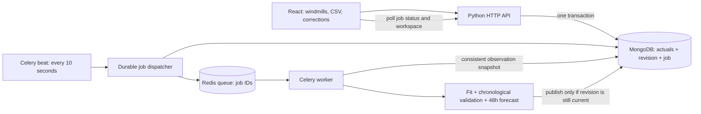

# Windmill data and training architecture

The running application uses MongoDB as its source of truth. The original
two-turbine forecasting scripts remain available for reproducibility; they do
not process newly registered windmills or uploaded measurements.

## Collections

| Collection | Records and indexes |
| --- | --- |
| `turbines` | Stable string `id`, name, latitude/longitude, optional rated kW, data/model revisions, active model ID, training status, creation/update timestamps. Unique `id`. |
| `actuals` | One current normalized hourly power value per `(turbine, time)`, revision and update timestamp. Unique compound index on `(turbine, time)`. |
| `imports` | Immutable submitted points, SHA-256 content digest, request ID, timestamp and result. Unique `(turbine, requestId)` provides retry deduplication and a correction audit trail. |
| `calculations` | Durable outbox and calculation history: turbine, input revision, reason, status, attempts, lease, timestamps, message, resulting model/forecast IDs and validation metrics. Indexes support queued-job dispatch and turbine history. |
| `models` | Immutable version, turbine/revision, training range, feature schema, sklearn version, metrics and the fitted joblib artifact as MongoDB binary. Artifacts are produced internally; the API never accepts executable model uploads. |
| `forecasts` | Immutable 48-point prediction runs with turbine, origin, model version, calculation ID, data revision, method and creation time. Unique run ID and turbine/origin index. Historical releases remain intact after retraining. |
| `settings` | Idempotent archive migration marker. |

All API timestamps are UTC ISO strings. Power remains normalized `[0, 1]`.
Rated capacity is metadata only: uploading kW values as normalized power is not
supported. Coordinates come from the database, including for the 3D map.

## Import and consistency rules

1. Validate the entire request before writing. Each point contains exactly
   `time` and `power`. Times must be whole hours with a timezone; their measurement
   interval `[time, time + 1 hour)` must have ended. Duplicate instants, nonfinite
   values, invalid coordinates and unknown windmills are rejected.
2. Upsert changed hours; preserve every unmentioned hour. A MongoDB transaction
   increments the windmill's `dataRevision`, writes actuals, records the import,
   and inserts a queued calculation together.
3. Retrying an identical request ID returns the saved result. Reusing it for
   different contents is rejected. Uploading unchanged values creates no new
   data revision or training job.
4. The dispatcher checks MongoDB every 10 seconds. Queued jobs are redispatched
   after 60 seconds until claimed. Redis outages cannot erase the durable job.
5. A worker atomically claims a job and reads a consistent training snapshot.
   Duplicate deliveries cannot claim the same running/completed job. Publication
   atomically stores model, forecast, metrics and the active-model pointer only
   when the input revision remains current and the worker still owns its lease.
6. Older work becomes `superseded`. Exceptions become `failed`; missing training
   data becomes `needs_data`. Both leave existing models and forecasts intact.
   The UI can explicitly queue another attempt.
7. Jobs have 14-minute soft / 15-minute hard worker limits and a 20-minute lease.
   The dispatcher requeues expired leases; after three interrupted attempts it
   marks the calculation failed. A reclaimed worker's new lease prevents a late
   old worker from publishing.

MongoDB must be a replica set because these operations use transactions. Compose
initializes a single-member `rs0` for local use. This enables transactions but is
not a redundant production database cluster.

## Retrained model

Each windmill gets its own `HistGradientBoostingRegressor`. Inputs are power lags
of 1, 2, 24 and 48 hours plus cyclic hour/day-of-week features. This supports new
locations without inventing weather or reusing the original site's weather.
The original frozen ECMWF model and archive are preserved separately.

Training requires at least 48 labeled training examples before a chronological
24-hour validation tail. A gap-free five-day series (120 measurements) satisfies
the minimum. The last 72 measured hours must be contiguous. Gaps elsewhere are
not interpolated; examples with missing lag inputs are excluded.

Validation is recursive: predictions feed subsequent lags, and held-out labels
are not supplied as features. Both model MAE and a fixed last-value baseline MAE
are saved. The final estimator is then fit to all eligible rows and produces
48 recursive predictions. Metrics are reported, not a guarantee of future
accuracy; there is currently no automatic quality-based promotion threshold.

The forecast origin is the end of the most recent measured hour, not today's
date or the worker's execution time. To preserve the existing API convention,
returned targets are `origin + 1h` through `origin + 48h`; the internally required
prediction at `origin` is a warm-up step. Weather values are `null` and the method
is explicitly `autoregressive`. Correcting old data therefore creates a new
version of the same historical release rather than claiming a live forecast.

## Limits and retained history

- An upload accepts 1–10,000 points and at most 2 MiB of JSON. CSV preview has the
  same row/file limits; requests exceeding the JSON limit are rejected intact.
- The workspace returns at most 100 recent forecast versions and 10,000 recent
  actual hours per windmill. Full history remains in MongoDB.
- Training reads the latest 50,000 measured hours per windmill. The saved model
  metadata records the exact consumed row count and time range.
- Calculation listing returns the latest 100 jobs for a windmill. Model
  artifacts are limited to 12 MiB to remain below MongoDB's document-size limit.
- There is no automatic data deletion, TTL, or retention pruning.

## API

| Method / route | Body / result |
| --- | --- |
| `GET /api/health` | MongoDB connectivity and API status |
| `GET /api/workspace` | `{ turbines, runs, observations, meta }` |
| `POST /api/turbines` | `{ name, latitude, longitude, ratedPowerKw: number \| null }`; returns the new windmill |
| `POST /api/turbines/:id/actuals` | `{ requestId, points: [{ time, power }] }`; returns `{ changed, dataRevision, jobId }` |
| `POST /api/turbines/:id/train` | `{}`; queues/reuses an active job for the current revision and returns its status |
| `GET /api/calculations?turbine=:id` | `{ calculations: [...] }` |
| `GET /api/calculations/:id` | One durable job, including result IDs and metrics |
| `POST /api/forecasts` | `{ turbine }`; compatibility alias for queueing training, no longer synchronous archive recalculation |

Writes use the existing same-origin JSON boundary. This is a local/trusted
workspace application; user authentication and authorization are not implemented.
Compose exposes only the frontend on loopback. Keep MongoDB and Redis private.

## Bootstrap and operations

On first API startup, a transaction imports the two configured windmills,
saved forecast runs and available January actuals into MongoDB. A migration
marker prevents later restarts from overwriting data or corrections. The old
filesystem archive is never modified by the new worker.

MongoDB and Redis have independent persistent Compose volumes. `docker compose
down` preserves those volumes; deleting volumes deletes stored data. Back up
MongoDB with `mongodump` before moving or upgrading a populated installation.
Redis is transport only; MongoDB contains authoritative jobs and results.

Run exactly one Celery beat scheduler. Additional worker processes/containers
can share the same database and queue. Scale based on CPU and memory: each
training operation limits numerical libraries to two threads.

See [DEPLOYMENT.md](DEPLOYMENT.md) for launch and test commands.
